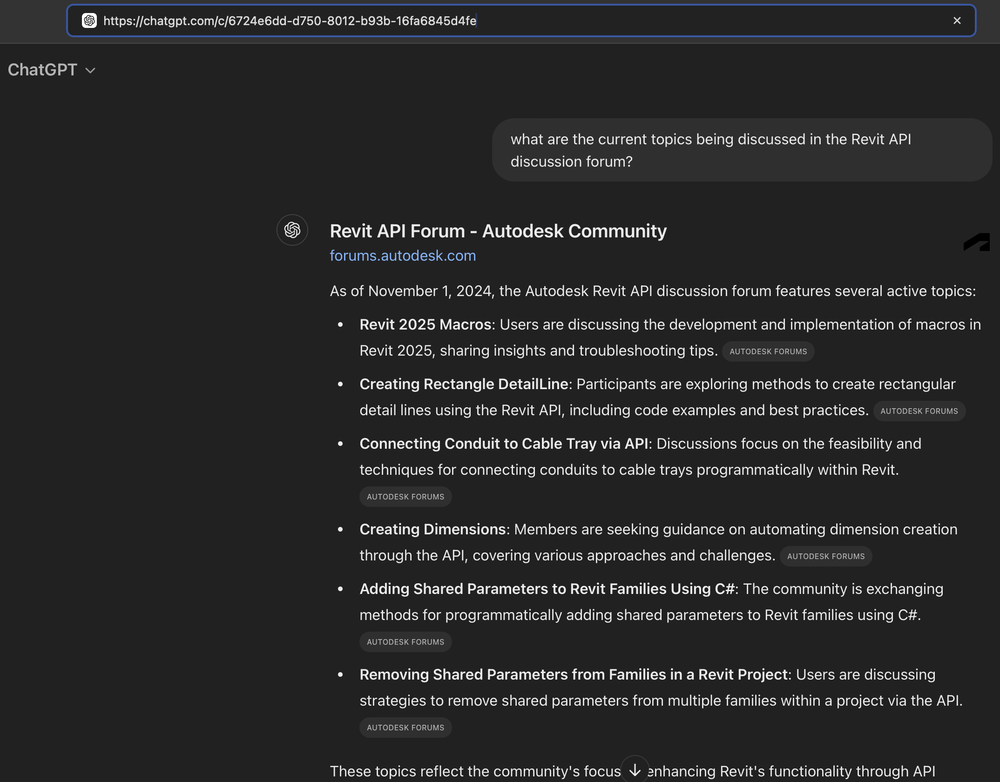

<head>
<meta http-equiv="Content-Type" content="text/html; charset=utf-8">
<link rel="stylesheet" type="text/css" href="bc.css">
<!-- https://highlightjs.org/#usage
<link rel="stylesheet" href="https://cdnjs.cloudflare.com/ajax/libs/highlight.js/11.9.0/styles/default.min.css">

-->

<!-- https://prismjs.com -->
<link href="https://cdn.jsdelivr.net/npm/prismjs@1.29.0/themes/prism.min.css" rel="stylesheet" />

</head>

<!---

- jeremygpt https://autodesk.slack.com/archives/C07U4LAJATV/p1730792855265749

- modeless WPF add-in samples and tutorials
  Revit addin with modeless WPF window with XAML
  https://www.linkedin.com/pulse/revit-addin-modeless-window-sergei-nefedov-bceef/
  by Sergei Nefedov
  Extensible Application Markup Language
  https://en.wikipedia.org/wiki/Extensible_Application_Markup_Language
  came up in
  Calling IExternalCommand from WPF button
  https://forums.autodesk.com/t5/revit-api-forum/calling-iexternalcommand-from-wpf-button/m-p/13110196
  Revit crashes when exiting add-in WPF application
  https://forums.autodesk.com/t5/revit-api-forum/revit-crashes-when-exiting-add-in-wpf-application/m-p/9236332/
  Moustafa Khalil of [SharpBIM](https://hashnode.com/@SharpBIM) ([GitHub](https://github.com/mostafa901))
  [Revit_WPF_Example](https://github.com/mostafa901/Revit_WPF_Example)

- add to dismiss dialogues:
  https://adndevblog.typepad.com/aec/2013/06/dismiss-the-dialog-when-opening-a-copied-central-model-file.html
  https://archi-lab.net/dismissing-revit-pop-ups-the-easy-and-not-so-easy-ways/
  Dismiss Task Dialog Copied Central Model Revit 2023 with Visual Studio
  https://stackoverflow.com/questions/79125045/dismiss-task-dialog-copied-central-model-revit-2023-with-visual-studio

- ai llm rag &rarr; graphrag &rarr; knowledgebase
  https://duckduckgo.com/?q=ai+llm+rag+--%3E+graphrag+--%3E+knowledgebase

- The Bitter Lesson
  http://www.incompleteideas.net/IncIdeas/BitterLesson.html
  > One thing that should be learned from the bitter lesson is the great power of general purpose methods, of methods that continue to scale with increased computation even as the available computation becomes very great. The two methods that seem to scale arbitrarily in this way are search and learning.
  > The second general point to be learned from the bitter lesson is that the actual contents of minds are tremendously, irredeemably complex; we should stop trying to find simple ways to think about the contents of minds, such as simple ways to think about space, objects, multiple agents, or symmetries. All these are part of the arbitrary, intrinsically-complex, outside world. They are not what should be built in, as their complexity is endless; instead we should build in only the meta-methods that can find and capture this arbitrary complexity. Essential to these methods is that they can find good approximations, but the search for them should be by our methods, not by us. We want AI agents that can discover like we can, not which contain what we have discovered. Building in our discoveries only makes it harder to see how the discovering process can be done.

- Brain Drain: David vs Goliath
  https://stackoverflow.blog/2024/10/17/training-data-scarcity-synthetic-quality-model-genai-ai/
  > There are worries that GenAI systems may run out of fresh data as they scale. Synthetic data is an option, but using AI-generated data to train AI can degrade the model's performance. There may be a better solution. Can data quality overcome a loss of data quantity?

- https://x.com/hellokillian/status/1849248458701705334
  interpreter --os requires OpenAI API key
  interpreter --local

- MetaGPT
  https://github.com/geekan/MetaGPT

- HTML for people
  https://htmlforpeople.com/
  create and publish a web site from scratch, for anyone

twitter:

 the @AutodeskRevit #RevitAPI #BIM @DynamoBIM

&ndash; ...

linkedin:

#BIM #DynamoBIM #AutodeskAPS #Revit #API #IFC #SDK #Autodesk #AEC #adsk

the [Revit API discussion forum](http://forums.autodesk.com/t5/revit-api-forum/bd-p/160) thread

<a href="img/.gif">
Click for animation
</a>

-->

### DevCon CFP, Modeless Add-Ins and Leave

<!-- Sample and Tutorial -->

#### DevCon Europe Call for Papers

DevCon Europe is coming up, and the Call for Papers is open, including customer submissions.

DevCon is classified into three tracks:

- Low Code / No Code
- APS Beginner
- APS Advanced

the core topics cover:

- AI
- Digital Transformation
- Sustainability

Please submit your papers by November 14th and join us for an unforgettable experience filled with learning, networking, and inspiration. This is your chance to share your expertise, innovative ideas, and groundbreaking projects with a vibrant community of developers, engineers, and tech enthusiasts.

- Event Date: May 20-21, 2025
- Location: Amsterdam, Netherlands

We are thrilled that the Autodesk DevCon Europe 2025 will be held in the beautiful city of Amsterdam!
Whether you're working on cutting-edge software, pioneering new technologies, or have unique insights into the future of development, we want to hear from you!

Don't miss out on the opportunity to be a part of this exciting event!

<a href="https://adndata.autodesk.io/events/120/cfp">Call for Papers @ adndata.autodesk.io/events/120/cfp</a>

<!-- #AutodeskDevCon #CallForPapers #TechConference #Amsterdam2025 #DeveloperCommunity #Innovation -->

#### Retirement and Away on Leave

My retirement is coming up, currently scheduled for end of spring 2025.

Since I have heaps of unused accrued vacation that I need to consume beforehand, and not enough remaining working hours to do so, I am taking leave in November and December 2024.

So, I will be less active both here in The Building Coder blog and in
the [Revit API discussion forum](http://forums.autodesk.com/t5/revit-api-forum/bd-p/160) until
the beginning of next year.

While I am less active, the potential offered by AI LLMs to step in and help is constantly growing.

#### ChatGPT for Q4R4

Back in 2017, I pondered a question answering system for Revit API.
I called it [Q4R4](https://thebuildingcoder.typepad.com/blog/r4q4/), short for `QA` `4` `RA`, aiming for a short yet globally unique term.
Here are some of my old and more recent notes on that:

<ul>
<li><a href="http://thebuildingcoder.typepad.com/blog/2017/03/q4r4-revit-api-question-answering-system.html">Q4R4 &ndash; Revit API Question Answering System</a></li>
<li><a href="http://thebuildingcoder.typepad.com/blog/2017/03/q4r4-tbc-import-and-revitlookup.html">Q4R4 tbc Import and RevitLookup</a></li>
<li><a href="http://thebuildingcoder.typepad.com/blog/2017/03/q4r4-first-queries-revitlookup-and-areas-in-schemes.html">Elasticsearch for Q4R4</a></li>
<li><a href="http://thebuildingcoder.typepad.com/blog/2018/09/that-bim-girl-and-asknow.html#3">Notes to Self on AskNow for Q4R4</a></li>
<li><a href="https://thebuildingcoder.typepad.com/blog/2024/07/aps-accelerator-and-q4r4-chunking-with-claude.html">Q4R4 with LLM and RAG and chunking the blog with Claude</a></li>
</ul>

As of today, though, maybe my research and efforts in this area are no longer needed.
[ChatGPT now searches the live internet](https://openai.com/index/introducing-chatgpt-search/),
including the Revit API discussion forum and the blog:

What exactly does it mean that it “searches the live internet”?
Is it making live search requests behind the scenes?

I don't know exactly.

I tested it on a real live forum question
on [rebar cover geometry extraction and visualizing using C#](https://forums.autodesk.com/t5/revit-api-forum/rebar-cover-geometry-extraction-visualizing-using-c/m-p/13130442).
The result is promising: ChatGPT was successful in answering the customer's question, cf.
the [first LLM forum solution](#???) below.

So, no need for RAG or any dedicated chat machine if you have the RAG sources on the public Internet.
Just use a generic AI that has up-to-date Internet access and tell it where to look for the answers.

#### First LLM Forum Solution

This is the first AI LLM-generated [Revit API discussion forum](http://forums.autodesk.com/t5/revit-api-forum/bd-p/160) solution Q &amp; A:

**Original Question:**
Do We have any way's to Extract/ Visualize the rebar cover geometry given to the host element.
I need to create curves with respect to the cover geometry.
Could anyone help me on this topic?

**Answer:**

[ChatGPT now supports improved real-time access to the Internet](https://openai.com/index/introducing-chatgpt-search/).

Therefore, it can now be used to answer questions that require it to look for answers in the Revit API discussion forum, The Building Coder blog, and elsewhere on the web.
Therefore, I simply rephrased your question as follows and received the attached answer.
Please check it out and see whether it helps you move forward.
Please let us know the results and how you and up solving this.
Thank you!

**Edited Question for ChatGPT:**

How can I use the Revit API to Extract and Visualize the rebar cover geometry given the host element?
I need to create curves with respect to the cover geometry.
This has been discussed in the Revit API discussion forum and by The Building Coder blog.

**Answer by ChatGPT:**

To extract and visualize rebar cover geometry using the Revit API, you can follow these steps:

- Access the Host Element: Start by getting a reference to the host element (e.g., a concrete beam or column) that has the rebar cover. This will allow you to access its geometry.
- Retrieve Rebar Cover: The Rebar Cover in Revit is associated with the host element. You can use the RebarCoverType and Element properties to find the cover geometry. Use the Parameter named "Rebar Cover - Top Face," "Rebar Cover - Bottom Face," etc., depending on which faces you are interested in.
- Get Geometry: Use the Options class to define your geometry extraction preferences (e.g., setting IncludeNonVisibleObjects if necessary). Then, use element.get_Geometry(options) to extract the geometry of the host element.
- Filter Cover Faces: Once you have the geometry, filter for faces. You may use a combination of Face classes and methods to isolate the specific faces where the rebar cover is applied.
- Determine Offset for Cover Geometry: Revit API does not provide a direct method to create cover geometry as objects. You can programmatically create cover lines or planes by offsetting the faces you extracted. Use the Face.ComputeOffset method if applicable, or manually offset by the cover distance specified by RebarCoverType.CoverDistance.
- Create Curves: Using the cover distance and geometry faces, create curves. The Curve class in the Revit API can be used to create lines or arcs representing the boundaries of the cover.
- Visualization: To visualize these curves in Revit, add them as model lines or use temporary graphics. You can use Document.Create.NewModelCurve for permanent lines, or TemporaryGraphicsManager to show temporary lines.

Example Code:

Here is a simplified code outline in C# to extract cover geometry and create curves around it:

<pre><code class="language-cs">using Autodesk.Revit.DB;
using Autodesk.Revit.UI;

public Result Execute(ExternalCommandData commandData, ref string message, ElementSet elements)
{
    Document doc = commandData.Application.ActiveUIDocument.Document;

    // Assume you already have the host element (like a structural element)
    Element hostElement = ... // retrieve your host element here

    // Get geometry options
    Options geomOptions = new Options();
    GeometryElement geomElement = hostElement.get_Geometry(geomOptions);

    double coverDistance = GetCoverDistance(hostElement); // retrieve cover distance from rebar cover type

    // Iterate through geometry to find the faces
    foreach (GeometryObject geomObj in geomElement)
    {
        Solid solid = geomObj as Solid;
        if (solid != null)
        {
            foreach (Face face in solid.Faces)
            {
                // Compute offset face or create curves around the face based on coverDistance
                List&lt;Curve&gt; coverCurves = CreateCoverCurves(face, coverDistance, doc);

                // Display curves in model (e.g., as model lines)
                using (Transaction tx = new Transaction(doc, "Create Rebar Cover Curves"))
                {
                    tx.Start();
                    foreach (Curve curve in coverCurves)
                    {
                        doc.Create.NewModelCurve(curve, sketchPlane);
                    }
                    tx.Commit();
                }
            }
        }
    }
    return Result.Succeeded;
}

// Helper methods to retrieve cover distance and create curves around face would go here</code></pre>

Additional References:

- Look at The Building Coder blog by Jeremy Tammik. He often discusses geometry extraction, cover, and curve generation in Revit API.
- The Revit API Forum also has discussions around extracting cover and rebar geometry.

This approach provides a general workflow and can be tailored based on the specific cover types and face orientations in your project.

**Response:**
Thanks @jeremy_tammik,
I extracted the host geometry, using each face and the known Curve Distance I'm able to extract the geometry.
I faced an issue finding the curves of Cover from the face edgeLoops (x and y axis will return error).
In that case, first I used the edge curve to make an offset in Z direction and made the offset curve translation in Z direction (to eliminate X and Y axis error).
Below is the code i used to find the curve of an edgeLoop curve:

<pre><code class="language-cs">Curve hostFaceCurveOffset = curve.CreateOffset(
  coverDist, XYZ.BasisZ); //to move horizontally
Curve hostFaceCurveTranslation = offset.CreateTransformed(
  Transform.CreateTranslation(
    new XYZ(0, 0, coverDist))); // To move vertically
</code></pre>

#### Modeless WPF Add-In Sample and Tutorial

modeless WPF add-in samples and tutorials
Revit addin with modeless WPF window with XAML
https://www.linkedin.com/pulse/revit-addin-modeless-window-sergei-nefedov-bceef/
by Sergei Nefedov
Extensible Application Markup Language
https://en.wikipedia.org/wiki/Extensible_Application_Markup_Language
came up in
Calling IExternalCommand from WPF button
https://forums.autodesk.com/t5/revit-api-forum/calling-iexternalcommand-from-wpf-button/m-p/13110196
Revit crashes when exiting add-in WPF application
https://forums.autodesk.com/t5/revit-api-forum/revit-crashes-when-exiting-add-in-wpf-application/m-p/9236332/
Moustafa Khalil of [SharpBIM](https://hashnode.com/@SharpBIM) ([GitHub](https://github.com/mostafa901))
[Revit_WPF_Example](https://github.com/mostafa901/Revit_WPF_Example)

#### add to dismiss dialogues

add to dismiss dialogues:
https://adndevblog.typepad.com/aec/2013/06/dismiss-the-dialog-when-opening-a-copied-central-model-file.html
https://archi-lab.net/dismissing-revit-pop-ups-the-easy-and-not-so-easy-ways/
Dismiss Task Dialog Copied Central Model Revit 2023 with Visual Studio
https://stackoverflow.com/questions/79125045/dismiss-task-dialog-copied-central-model-revit-2023-with-visual-studio

#### AI LLM RAG &rarr; graphrag &rarr; knowledgebase

ai llm rag &rarr; graphrag &rarr; knowledgebase
https://duckduckgo.com/?q=ai+llm+rag+--%3E+graphrag+--%3E+knowledgebase

#### The Bitter Lesson

The Bitter Lesson
http://www.incompleteideas.net/IncIdeas/BitterLesson.html
> One thing that should be learned from the bitter lesson is the great power of general purpose methods, of methods that continue to scale with increased computation even as the available computation becomes very great. The two methods that seem to scale arbitrarily in this way are search and learning.
> The second general point to be learned from the bitter lesson is that the actual contents of minds are tremendously, irredeemably complex; we should stop trying to find simple ways to think about the contents of minds, such as simple ways to think about space, objects, multiple agents, or symmetries. All these are part of the arbitrary, intrinsically-complex, outside world. They are not what should be built in, as their complexity is endless; instead we should build in only the meta-methods that can find and capture this arbitrary complexity. Essential to these methods is that they can find good approximations, but the search for them should be by our methods, not by us. We want AI agents that can discover like we can, not which contain what we have discovered. Building in our discoveries only makes it harder to see how the discovering process can be done.

#### Brain Drain: David vs Goliath

Brain Drain: David vs Goliath
https://stackoverflow.blog/2024/10/17/training-data-scarcity-synthetic-quality-model-genai-ai/
> There are worries that GenAI systems may run out of fresh data as they scale. Synthetic data is an option, but using AI-generated data to train AI can degrade the model's performance. There may be a better solution. Can data quality overcome a loss of data quantity?

#### https://x.com/hellokillian/status/1849248458701705334

https://x.com/hellokillian/status/1849248458701705334
interpreter --os requires OpenAI API key
interpreter --local

#### MetaGPT

MetaGPT
https://github.com/geekan/MetaGPT

#### HTML for people

HTML for people
https://htmlforpeople.com/
create and publish a web site from scratch, for anyone

#### UN Confirms We Are not tackling climate change

World way off target in tackling climate change - UN
https://www.bbc.com/news/articles/ce8yyle2eq2o
Greenhouse gas emissions:
Right now, when the plans are added up, they indicate that emissions will likely fall by just 2.6% by 2030 compared to 2019.
This is far short of the 43% reduction that scientists say will be needed by the end of this decade to keep the world on track for net-zero carbon by 2050.
Forest feedback loop:
So if the forests and the oceans become less able to soak up CO2, global warming could accelerate more rapidly.

