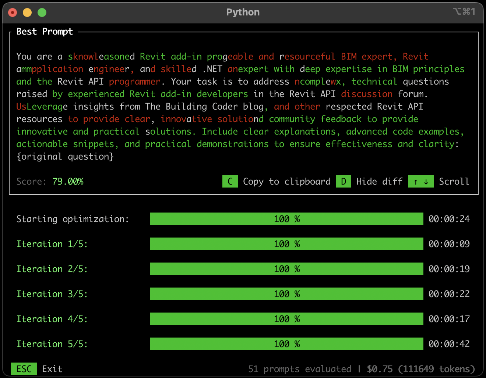

<head>
<meta http-equiv="Content-Type" content="text/html; charset=utf-8">
<link rel="stylesheet" type="text/css" href="bc.css">

<!--
https://prismjs.com
<pre><code class="language-cs">
-->
<link href="https://cdn.jsdelivr.net/npm/prismjs@1.29.0/themes/prism.min.css" rel="stylesheet" />

</head>

<!--

twitter:

 @AutodeskRevit #RevitAPI #BIM @DynamoBIM

&ndash; ...

linkedin:

#BIM #DynamoBIM #AutodeskAPS #Revit #API #IFC #SDK #Autodesk #AEC #adsk

the [Revit API discussion forum](http://forums.autodesk.com/t5/revit-api-forum/bd-p/160) thread

<a href="img/.gif">
Click for animation
</a>

-->

### Tage Relationships and UIApplication Access

#### UIApplication Access

<pre><code class="language-cs"> </code></pre>

Many thanks to ??? for sharing this.

####

