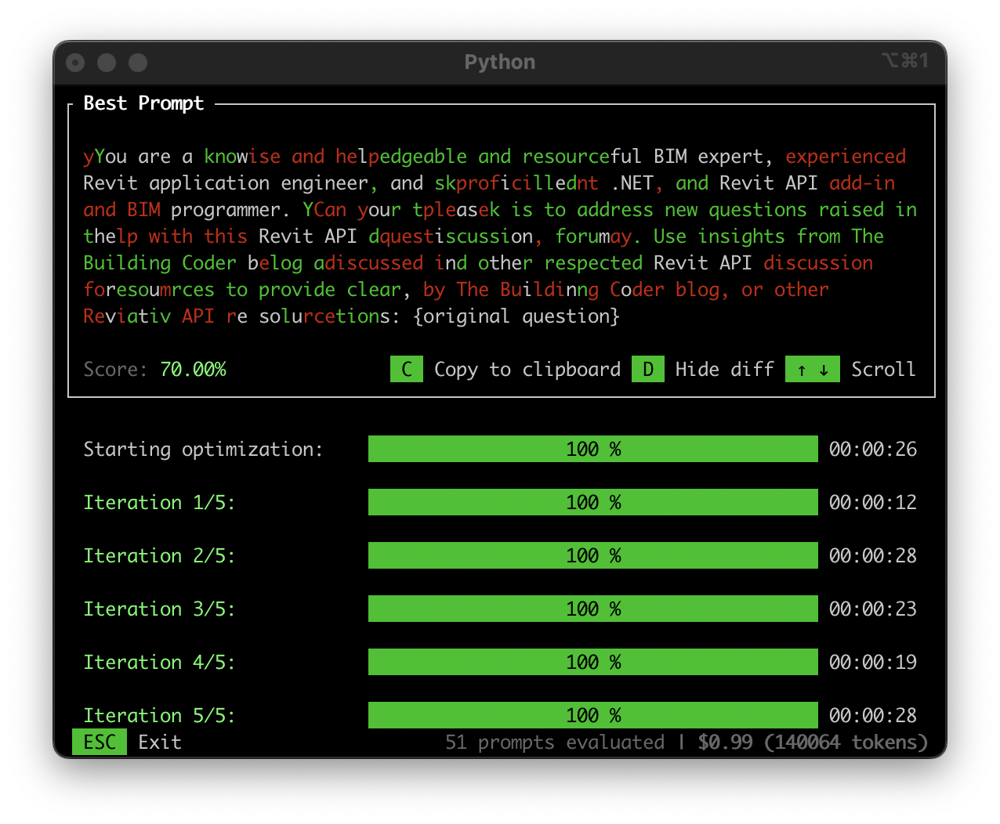

<head>
<meta http-equiv="Content-Type" content="text/html; charset=utf-8">
<link rel="stylesheet" type="text/css" href="bc.css">

<!--
https://prismjs.com
<pre><code class="language-cs">
-->
<link href="https://cdn.jsdelivr.net/npm/prismjs@1.29.0/themes/prism.min.css" rel="stylesheet" />

</head>

<!--

- How to get UIApplication from IExternalApplication
  https://forums.autodesk.com/t5/revit-api-forum/how-to-get-uiapplication-from-iexternalapplication/td-p/6355729

- relationshiop between tagged element and tag
  how to gets relation of element with its tag or its label?
  https://forums.autodesk.com/t5/revit-api-forum/how-to-gets-relation-of-element-with-its-tag-or-its-label/m-p/13262988
  I have doors.
  I have door tags
  want to verify the whether  particular tags present on that  particular door?
  A1:
  Contributor TWhitehead_HED
  2024-03-21 08:17 AM
  There's a saying about assuming... I'll leave it up to you to find on the internet.
  For others scraping through these posts looking for a modicum of actual help, here's how I ended up solving it with help from @Mohamed_Arshad (who actually provided some guidance).
  using (Transaction trans = new Transaction(doc, "Tag Parent Doors"))
  {
      trans.Start();

      foreach (FamilyInstance door in doors)
      {
          if (new FilteredElementCollector(doc, currentView.Id)
               .OfCategory(BuiltInCategory.OST_DoorTags)
               .OfClass(typeof(IndependentTag))
               .Cast<IndependentTag>()
               .SelectMany(x => x.GetTaggedLocalElementIds())
               .Where(x => x == door.Id).Any())
          {
              skipCount++;
              continue;
          }
      }
  }
  A2:
  Advocate DanielKP2Z9V
  ‎2025-01-15 12:08 PM
  If anyone lands here looking for a reference how to switch selection between tags and their hosts I have commands to
  [SelectAssociatedTags](https://0x0.st/8o_A.bin)
  and
  [SelectElementsHostedBySelectedTags]()(https://0x0.st/8o_T.bin)

- Self-Operating Computer Framework
  https://github.com/OthersideAI/self-operating-computer
  A framework to enable multimodal models to operate a computer

- BigBlueButton
  https://bigbluebutton.org/#
  conferencing:
  https://bbb.m4h.network/b/
  Greenlight is a simple front-end for your BigBlueButton open-source web conferencing server.
  You can create your own rooms to host sessions, or join others using a short and convenient link.
  Mainstream google: google meet --  https://workspace.google.com/products/meet/
  https://thebuildingcoder.typepad.com/blog/2024/05/migrating-vb-to-net-core-8-and-ai-news.html#4
  Alternativ open source: Jitsi meet -- https://jitsi.org/
  Facetime can also be used in the browser, hence on any platform; you just need a link provided by an Apple user.

- The Wired Guide to Protecting Yourself From Government Surveillance
  https://www.wired.com/story/the-wired-guide-to-protecting-yourself-from-government-surveillance/

- Postel's law or the Robustness principle
  https://en.wikipedia.org/wiki/Robustness_principle
  is applicable not only in software protocols and software design in general, but in every aspect of everyday life:
  be conservative in what you do, be liberal in what you accept from others
  keep calm, carry on, and be kind and tolerant
  that helps everybody

twitter:

 @AutodeskRevit #RevitAPI #BIM @DynamoBIM

&ndash; ...

linkedin:

#BIM #DynamoBIM #AutodeskAPS #Revit #API #IFC #SDK #Autodesk #AEC #adsk

the [Revit API discussion forum](http://forums.autodesk.com/t5/revit-api-forum/bd-p/160) thread

<a href="img/.gif">
Click for animation
</a>

-->

### Tage Relationships and UIApplication Access

#### Revit API Support with Gemini LLM

I continue using LLMs to answer the odd query in
the [Revit API discussion forum](http://forums.autodesk.com/t5/revit-api-forum/bd-p/160) with
great success.

I check the question and evaluate whether I can answer it myself or not.
In some cases, I can only address it incompletely.
In some cases, I decide to ask the LLM for help.
Recently, I have mostly been using Gemini 2.0 Flash.

When  doing so, I prefix the persona prompt that I developed and refined.
I described my prompt development process in the past few posts, cf.,
[first LLM forum solution](https://thebuildingcoder.typepad.com/blog/2024/11/devcon-ai-for-revit-api-modeless-add-ins-leave.html#5),
[Revit API support prompt](https://thebuildingcoder.typepad.com/blog/2025/01/llm-prompting-rag-ingestion-and-new-projects.html#5),
and [promptimalising my Revit API support prompt](https://thebuildingcoder.typepad.com/blog/2025/01/wall-layer-voodoo-and-prompt-optimisation.html#3)

My current prompt is this:

- You are a seasoned Revit add-in programmer and .NET expert with deep expertise in BIM principles and the Revit API.
Your task is to address complex, technical questions raised by experienced Revit add-in developers in the Revit API forum.
Leverage insights from The Building Coder blog, respected Revit API resources, and community feedback to provide innovative and practical solutions.
Include clear explanations, advanced code examples, actionable snippets, and practical demonstrations to ensure effectiveness and clarity:
{original question}

Here are some recent sample threads enlisting help from the LLM:

- [Create Beams from level](https://forums.autodesk.com/t5/revit-api-forum/create-beams-from-level/td-p/13260688)
- [How to reduce size of columns in above floors without changing its parameters](https://forums.autodesk.com/t5/revit-api-forum/how-to-reduce-size-of-columns-in-above-floors-without-changing/m-p/13261920)
- [Renombrado de parámetros compartidos (Rename shared parameter)](https://forums.autodesk.com/t5/revit-api-forum/renombrado-de-parametros-compartidos-rename-shared-parameter/td-p/13262126)
- [Dynamo Script Compatibility Issue for Wall Penetrations](https://forums.autodesk.com/t5/revit-api-forum/dynamo-script-compatibility-issue-for-wall-penetrations/td-p/13262124)
- [Retrieving Active Users in a Revit Central Model File (File-Based)](https://forums.autodesk.com/t5/revit-api-forum/retrieving-active-users-in-a-revit-central-model-file-file-based/td-p/13272841)
- [Direct context 3D over view](https://forums.autodesk.com/t5/revit-api-forum/direct-context-3d-over-view/td-p/13273446)
- [Get Elements in linked model when creating a schedule](https://forums.autodesk.com/t5/revit-api-forum/get-elements-in-linked-model-when-creating-a-schedule/td-p/13273405)

I cannot always completely verify that the answer provided is completely accurate.
Repeating the question will yield a different answer every time.
So, a customer seeking perfection would be well advised to submit it several times over and pick the best one, or the best bits from several.

I often do check that the API calls in the sample code exist.
In one of the cases listed above, Gemini produced sample code that hallucinated non-existent Revit API calls.
I noticed that and replied to the LLM, saying: “hey, the call you list in your sample code does not exists”.
Thereupon the LLM answered, “you are absolutely correct. Sorry about that. Here is true valid sample code instead”.
The second answer included true API calls, and I provided that to the customer.

So, important aspect to note: every answer will be different, and some answers contain hallucinations, so every interaction must be taken with a pinch of salt and not blindly trusting.

#### UIApplication Access

####

#### How to get UIApplication from IExternalApplication

How to get UIApplication from IExternalApplication
https://forums.autodesk.com/t5/revit-api-forum/how-to-get-uiapplication-from-iexternalapplication/td-p/6355729

#### relationshiop between tagged element and tag

relationshiop between tagged element and tag
how to gets relation of element with its tag or its label?
https://forums.autodesk.com/t5/revit-api-forum/how-to-gets-relation-of-element-with-its-tag-or-its-label/m-p/13262988
I have doors.
I have door tags
want to verify the whether  particular tags present on that  particular door?
A1:
Contributor TWhitehead_HED
2024-03-21 08:17 AM
There's a saying about assuming... I'll leave it up to you to find on the internet.
For others scraping through these posts looking for a modicum of actual help, here's how I ended up solving it with help from @Mohamed_Arshad (who actually provided some guidance).
using (Transaction trans = new Transaction(doc, "Tag Parent Doors"))
{
    trans.Start();

    foreach (FamilyInstance door in doors)
    {
        if (new FilteredElementCollector(doc, currentView.Id)
             .OfCategory(BuiltInCategory.OST_DoorTags)
             .OfClass(typeof(IndependentTag))
             .Cast<IndependentTag>()
             .SelectMany(x => x.GetTaggedLocalElementIds())
             .Where(x => x == door.Id).Any())
        {
            skipCount++;
            continue;
        }
    }
}
A2:
Advocate DanielKP2Z9V
If anyone lands here looking for a reference how to switch selection between tags and their hosts I have commands to
[SelectAssociatedTags](https://0x0.st/8o_A.bin)
and
[SelectElementsHostedBySelectedTags]()(https://0x0.st/8o_T.bin)

#### Self-Operating Computer Framework

Self-Operating Computer Framework
https://github.com/OthersideAI/self-operating-computer
A framework to enable multimodal models to operate a computer

#### BigBlueButton

I pointed out a couple of video conferencing options; here is another one:

BigBlueButton
https://bigbluebutton.org/#
conferencing:
https://bbb.m4h.network/b/
Greenlight is a simple front-end for your BigBlueButton open-source web conferencing server.
You can create your own rooms to host sessions, or join others using a short and convenient link.
Mainstream google: google meet --  https://workspace.google.com/products/meet/
https://thebuildingcoder.typepad.com/blog/2024/05/migrating-vb-to-net-core-8-and-ai-news.html#4
Alternativ open source: Jitsi meet -- https://jitsi.org/
Facetime can also be used in the browser, hence on any platform; you just need a link provided by an Apple user.

#### The Wired Guide to Protecting Yourself From Government Surveillance

The Wired Guide to Protecting Yourself From Government Surveillance
https://www.wired.com/story/the-wired-guide-to-protecting-yourself-from-government-surveillance/

#### Postel's law or the Robustness principle

Postel's law or the Robustness principle
https://en.wikipedia.org/wiki/Robustness_principle
is applicable not only in software protocols and software design in general, but in every aspect of everyday life:
be conservative in what you do, be liberal in what you accept from others
keep calm, carry on, and be kind and tolerant
that helps everybody

<pre><code class="language-cs"> </code></pre>

Many thanks to ??? for sharing this.
